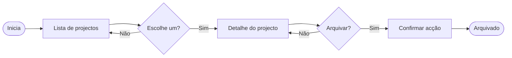

# Mermaid flows (senior)

O GitHub renderiza Mermaid em blocos ` ```mermaid `. Usa para a **sequência de
decisões e ecrãs** de uma feature — não para diagramas técnicos.

## Forma

````markdown

````

## Princípios

- **Pequeno.** 5–10 nós; mais → parte em flows separados ("Flow A: arquivar",
  "Flow B: desarquivar").
- **Decisões com `{}`**, ecrãs com `[]`, início/fim com `(())`.
- **Paths alternativos contam.** "E se cancelar?", "e se falhar?" → ramo explícito.
- **Sem detalhe técnico.** Não escrevas "POST /api/archive" — fica fora de escopo.

## Bom vs mau

✅ Mostra **"Confirmar?"** como decisão → captura intent.
❌ Mostra **"Validar input no servidor"** → detalhe de implementação, do engineering.

## Quando NÃO precisas

- Flow linear de 2–3 passos → uma frase em texto resolve.
- Já está coberto pelos wireframes + Given/When/Then.