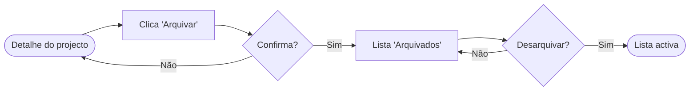

# PRD-0001: Arquivar projectos

> Exemplo seeded pelo template. Adapta ao teu domínio ou apaga quando começares
> a escrever os teus PRDs.

## Problema
Os *owners* de projecto acumulam projectos antigos que **não conseguem apagar**
sem medo de perder histórico. A lista de projectos activos enche-se e o tempo
para encontrar o que importa cresce.

## Win condition
**Qualitativa**: o owner consegue limpar a sua vista sem sentir que está a perder
algo — o histórico continua acessível.

**Quantitativa**: ≥ 30% dos owners arquivam pelo menos 1 projecto nos primeiros
30 dias após o lançamento; tempo médio para abrir um projecto activo cai ≥ 20%.

## Escopo
**Inclui**:
- Acção "Arquivar" no detalhe do projecto, com confirmação.
- Vista "Arquivados" com listagem paginada e filtro por data.
- Acção "Desarquivar" (sem fricção — é reversível).

**Não inclui** (deliberadamente):
- Auto-arquivar por inatividade — fica para um PRD futuro.
- Notificar membros do projecto sobre o arquivar — não há sinal de que importe.
- Apagar definitivamente — fora deste PRD.

## User stories

### S1 — Owner arquiva um projecto
- **Given** sou owner de um projecto activo
- **When** abro o detalhe, clico em "Arquivar" e confirmo
- **Then** o projecto deixa de aparecer na lista activa
- **And** aparece em "Arquivados" com a data do arquivo
- **And** as tarefas continuam acessíveis em modo leitura

### S2 — Owner consulta arquivados
- **Given** tenho projectos arquivados
- **When** abro "Arquivados"
- **Then** vejo a lista paginada, ordenada por data de arquivo (mais recente primeiro)
- **And** consigo filtrar por intervalo de datas

### S3 — Owner desarquiva
- **Given** vejo um projecto em "Arquivados"
- **When** clico em "Desarquivar"
- **Then** volta à lista activa imediatamente (sem confirmação — é reversível)

## Wireframes — Lista de Arquivados

```
┌────────────────────────────────────────────┐
│ Header: "Projectos arquivados"             │
│ <SearchInput placeholder="Procurar...">    │
│ <Filter label="Data" options=[...]>        │
├────────────────────────────────────────────┤
│ <ProjectRow>                               │
│   Title · Arquivado 12 Mai · [Desarquivar] │
│ <ProjectRow>                               │
│   ...                                      │
├────────────────────────────────────────────┤
│ <Pagination total=42 page=1>               │
└────────────────────────────────────────────┘
```

Estados a cobrir:
- **Loading**: `<Skeleton rows={3} />` (mantém estrutura — evita layout shift).
- **Empty**: "Ainda não arquivaste projectos." + `<Button>` "Voltar aos activos".
- **Error**: "Não foi possível carregar." + `<Button>` "Tentar de novo".

## User flow



## Riscos
- Owners podem confundir "arquivar" com "apagar" → a confirmação tem de deixar
  claro que é reversível.
- A migração inicial de projectos antigos não é parte deste PRD — se for preciso,
  abrir PRD separado.

## Decisões em aberto
Nenhuma neste momento. Se aparecerem ao implementar, abre um PDD em vez de
inventar a resposta.

## Links
- Roadmap: [../roadmap.md](../roadmap.md)
- Sprint que entrega S1+S2: [../../sprints/2026-W22.md](../../sprints/2026-W22.md)
